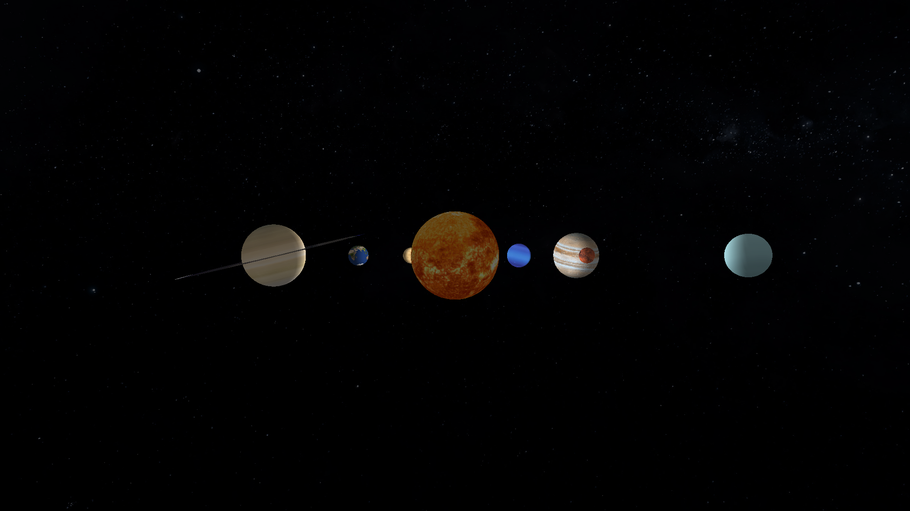

# Sistema Solar em OpenGL

Este projeto simula um sistema solar 3D utilizando **Python**, **Pygame** e **PyOpenGL**. Ele apresenta planetas texturizados orbitando uma estrela central (Sol), com suporte a anéis para planetas como Saturno.



## Funcionalidades

- Representação em 3D de corpos celestes (Sol, planetas e anéis).
- Órbitas com velocidades personalizáveis para cada planeta.
- Rotação individual dos planetas sobre seus eixos.
- Texturas realistas aplicadas aos corpos celestes.
- Iluminação dinâmicas para simular efeitos de luz.
- Suporte para visualizar os anéis de planetas (como Saturno).

---

## Requisitos

Certifique-se de ter os seguintes requisitos instalados:

- **Python 3.10+**
- **Pygame** (`pip install pygame`)
- **PyOpenGL** (`pip install PyOpenGL PyOpenGL_accelerate`)

---

## Explicação Técnica

### Iluminação
A iluminação no sistema solar é configurada para simular a luz emitida pelo Sol, utilizando os seguintes componentes:

- **Posição da Luz**: Fixa no centro da cena, representando o Sol como a principal fonte de luz.
- **Difusa**: Simula a luz incidente diretamente sobre os objetos, criando sombras e destaques naturais.
- **Ambiente**: Proporciona uma iluminação uniforme em toda a cena, garantindo visibilidade básica mesmo em áreas sombreadas.
- **Especular**: Gera reflexos brilhantes nos objetos, simulando superfícies reflexivas e contribuindo para um visual mais realista.

### Texturas
- As texturas são carregadas usando a biblioteca **Pygame** e mapeadas nos corpos celestes utilizando **OpenGL**.
- Elas permitem uma representação visual mais realista dos corpos celestes, com detalhes como cores e padrões específicos.
- As texturas utilizadas neste projeto foram obtidas do site Solar System Scope, que disponibiliza texturas de alta qualidade dos corpos celestes do sistema solar.
- As texturas estão licenciadas sob a Licença Creative Commons Atribuição 4.0 Internacional (CC BY 4.0). Isso significa que você pode usar, compartilhar e adaptar as texturas, desde que forneça a devida atribuição conforme as condições dessa licença.

### Órbita e Rotação
- **Órbita (Translação)**: Cada planeta possui uma velocidade de translação que define seu movimento em torno do Sol. Este movimento é configurado para cada planeta individualmente.
- **Rotação**: Cada planeta também gira sobre seu próprio eixo a uma velocidade configurada. Este comportamento simula o movimento diurno de cada corpo celeste.
- Essas propriedades são definidas no construtor da classe `CelestialBody`, que centraliza a lógica para o controle de movimento.

---

## Como Executar

1. Clone este repositório:
   ```bash
   git clone https://github.com/seuusuario/sistema-solar-opengl.git
   cd sistema-solar-opengl
   ```

2. Execute o programa:
    ```bash
    python main.py
    ```

3. Controles
    ESC: Sair do programa.